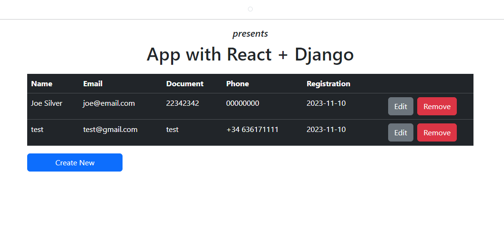

# Content

Font: <https://blog.logrocket.com/using-react-django-create-app-tutorial/>

## Introduction

```bash
pip3 install django djangorestframework django-cors-headers
```

```bash
django-admin startproject django_react_proj
```

## Adding models and views to Django

```bash
django-admin startapp students
```

## Migrating our Django models to the database

Font: <https://blog.logrocket.com/making-django-migrations-python/>

```bash
python manage.py makemigrations
```

```bash
python manage.py migrate
```

```bash
python3 manage.py makemigrations --empty --name students students
```

```bash
python manage.py migrate
```

## Diving into our Django REST API

Fonts:

- <https://blog.logrocket.com/django-rest-framework-create-api/>
- <https://www.django-rest-framework.org/api-guide/serializers/>
- <https://blog.logrocket.com/querysets-and-aggregations-in-django/>

Create serializers.py

... let’s open the urls.py

... students/views.py

## Testing our endpoints in Django

```bash
python manage.py runserver
```

## :rocket: Building the React app

```bash
npx create-react-app students-fe
```

## Setting up our React app to integrate with Django

- npm install bootstrap reactstrap axios --save
- import "bootstrap/dist/css/bootstrap.min.css";

## Working on the header component

...

## Working on the Creating New Student form

...

- <https://github.com/reactstrap/reactstrap>

## Working on the modal to edit student information

...

## Creating the students listing

...

## Working on the home component

...

npm start

## Final result

- python manage.py runserver
- npm start


